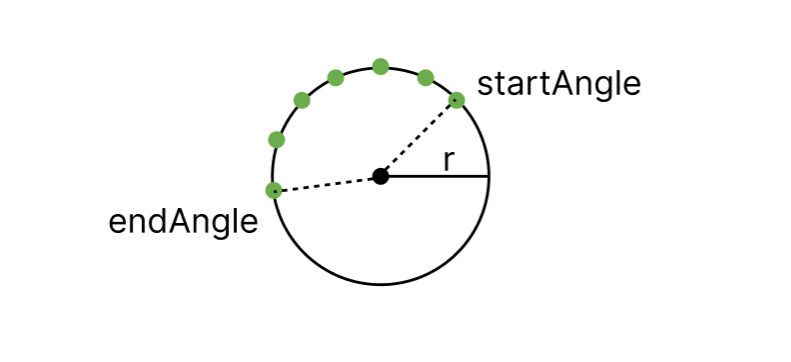
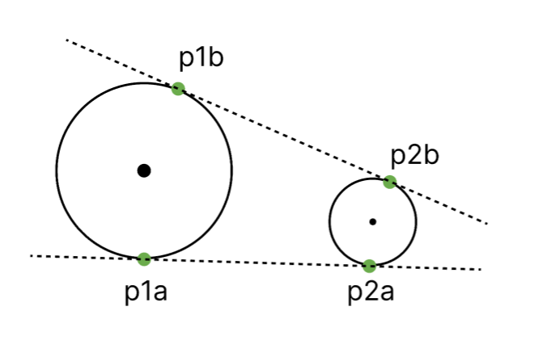
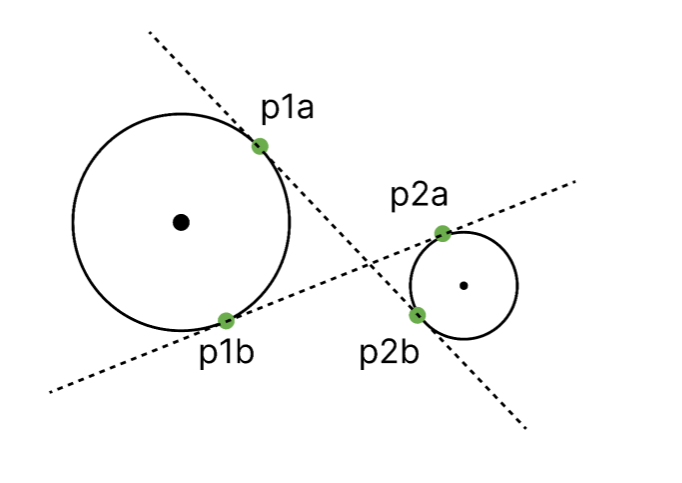
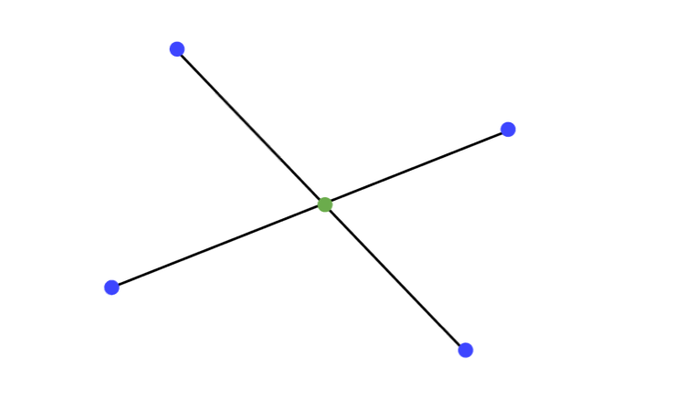
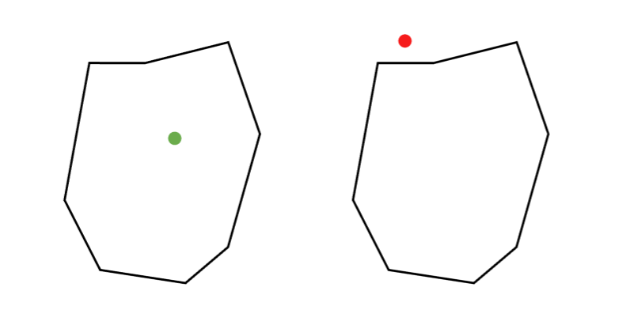
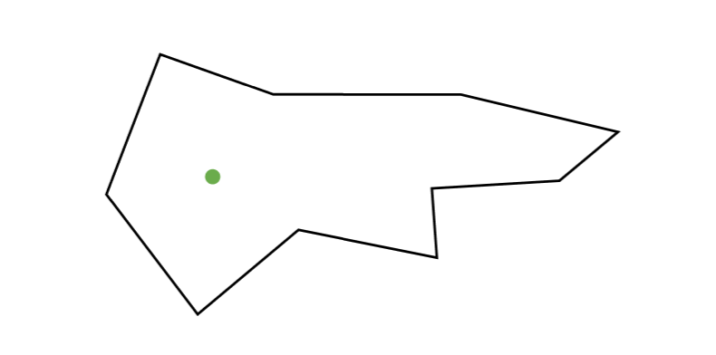
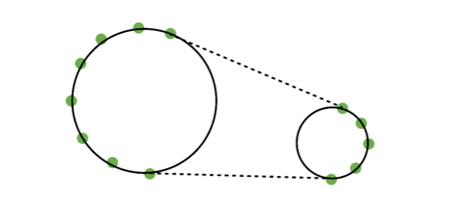
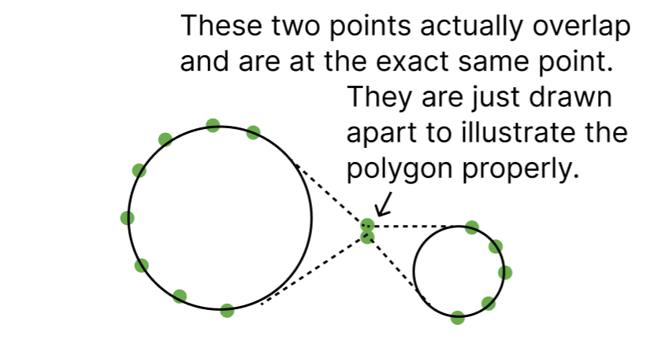
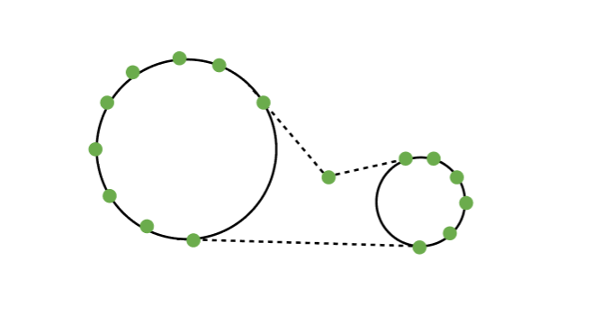
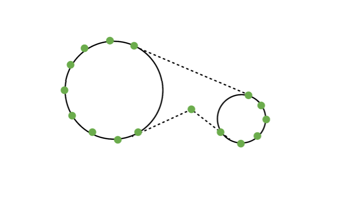

## calculateArcPoints
Given a circle with center { x, y } and radius r, this function calculates the points that make up the arc of the circle between two angles. If the endAngle is less than the startAngle, the arc will be computed in clockwise direction.

## calculateExternalTangents
Given two circles with centers { x1, y1 } and { x2, y2 } and radii r1 and r2, this function calculates the points that make up the external tangents of the two circles.

We will use these two tangents for the outer tripwires. The inner one will be simply the line connecting the two centers.

## calculateInternalTangents
Given two circles with centers { x1, y1 } and { x2, y2 } and radii r1 and r2, this function calculates the points that make up the internal tangents of the two circles.

We will use the internal tangents in case an outer tripwire is broken. You can see this in the createdMixedPolygon1, createdMixedPolygon2 and createInternalPolygon function.

## findIntersection
Given two lines defined by two points each, this function calculates the intersection point of the two lines.

## isPointInsidePolygon
Given a polygon defined by an array of points, this function checks if a point is inside the polygon.

## findPolygonCenter
Given a polygon defined by an array of points, this function calculates the center of the polygon. This won't be the centroid of the polygon, but "pole of inaccessibility". That is, the point that is furthest away from the polygon's boundary.

## createExternalPolygon
Given two circles with centers { x1, y1 } and { x2, y2 } and radii r1 and r2, this function creates the external polygon that connects the two circles. So kind of like spanning a rubber band around the two circles. Here we use the external tangents to create the polygon.

## createInternalPolygon
Given two circles with centers { x1, y1 } and { x2, y2 } and radii r1 and r2, this function creates the internal polygon that connects the two circles. Here we use the internal tangents and their intersection point to create the polygon.

## createMixedPolygon1
Given two circles with centers { x1, y1 } and { x2, y2 } and radii r1 and r2, this function creates the mixed polygon that connects the two circles. Here we use the external tangents, the internal tangents and the intersection point of the internal tangents to create the polygon.

## createMixedPolygon2
Given two circles with centers { x1, y1 } and { x2, y2 } and radii r1 and r2, this function creates the mixed polygon that connects the two circles. Here we use the external tangents, the internal tangents and the intersection point of the external tangents to create the polygon.

